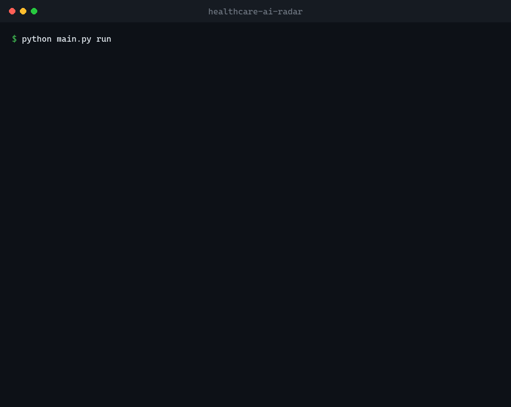

# Healthcare AI Radar

A lightweight, offline-friendly intelligence pipeline that tracks healthcare-AI
news, research and regulatory activity, ranks it by a transparent **Scoop
Score**, and writes a newsletter-ready digest.

It pulls from real sources every run - STAT News, the FDA, Nature Medicine,
trade press, arXiv and PubMed - filters to what is genuinely about *AI in
health*, de-duplicates across outlets, classifies each story, scores it, and
produces both a Markdown digest and a JSON sidecar.

Built to run on modest hardware with no GPU and no mandatory API keys. An LLM
summariser is optional; without it the tool falls back to deterministic
extractive summaries, so it always works.



> A real run: nine sources fetched (with automatic recovery from Cloudflare-blocked
> feeds), filtered, de-duplicated, ranked, and written to a digest.

---

## Why this exists

Anyone tracking healthcare AI faces the same problem: the signal is spread
across journals, preprint servers, regulators and a dozen trade outlets, and
most of it is noise. This tool automates the boring 90% - collecting,
de-duplicating, categorising and ranking - so a human editor can spend their
time on judgement and writing, which is the part that actually matters for a
newsletter.

The design is deliberately **not** a sprawling multi-agent platform. It is a
focused, well-tested pipeline that does one job well.

## What it does

- **Multi-source ingestion** - RSS, the arXiv Atom API, and PubMed E-utilities.
- **Relevance filtering** - keeps only stories about AI *and* health, using
  length-aware keyword matching (no false positives from words like "campaign").
- **De-duplication** - exact (tracking-param-aware) and cross-outlet headline
  matching, keeping the most credible copy.
- **Classification** - Regulation, Clinical Trial, Research, Funding, Product
  Launch, Drama, or General, from a curated lexicon.
- **Scoop Score (0-100)** - a transparent blend of source credibility, recency,
  story type and novelty signals, with the per-signal breakdown kept on record.
- **Summarisation** - optional LLM summaries under a strict JSON guardrail, with
  a deterministic extractive fallback.
- **Output** - a `latest.md` newsletter, a dated Markdown archive, and a JSON
  sidecar for downstream tools.

## Install

```bash
pip install -r requirements.txt
```

Python 3.11+ recommended. Core dependencies: `requests`, `feedparser`,
`python-dateutil`, `loguru` (+ `pytest` for the tests).

## Usage

```bash
python main.py run                    # fetch, rank and write today's digest
python main.py run --top-n 15         # more stories in the Top Scoops section
python main.py run --no-llm           # force deterministic extractive summaries
python main.py run --new-only --email # email only stories new since last run
```

Output lands in `output/`:
- `latest.md` - the newest digest (open this)
- `digest_<date>.md` - dated archive
- `digest_<date>.json` - machine-readable

### Optional LLM summaries

Copy `.env.example` to `.env` and set:

```
RADAR_LLM_PROVIDER=google
GOOGLE_API_KEY=your_key_here
GOOGLE_MODEL=gemini-2.5-flash
```

Also uncomment `google-genai` in `requirements.txt`. Everything works without
this - it is a quality upgrade, not a requirement.

### Configuration

All tunables live in `config/settings.py` and can be overridden by environment
variables: `RADAR_LOOKBACK_DAYS`, `RADAR_MAX_ITEMS_PER_SOURCE`,
`RADAR_HTTP_TIMEOUT`, `ENTREZ_EMAIL` (polite PubMed identification), and the LLM
settings above. Sources are a simple edit away in the same file.

## Automated email digests (scheduled)

The included GitHub Actions workflow ([.github/workflows/digest.yml](.github/workflows/digest.yml))
runs the pipeline **in the cloud every 4 hours** and emails you only the stories
that are new since the previous run - so you get fresh healthcare-AI news on your
phone without your laptop being on. It tracks what you've already been sent in a
small committed state file (`state/seen.json`), pruned by age.

To enable it:

1. **Create a Gmail App Password** (one-time): turn on 2-Step Verification, then
   go to Google Account -> Security -> App passwords, and generate a 16-character
   password. (App passwords are required; your normal login password will not
   work for SMTP.)
2. **Add repository secrets**: in the repo, Settings -> Secrets and variables ->
   Actions -> New repository secret, add:
   - `EMAIL_USERNAME` - your Gmail address
   - `EMAIL_PASSWORD` - the 16-character App Password
   - `EMAIL_TO` - where to receive the digest (can be the same address)
3. The workflow then runs on its schedule. You can also trigger it manually from
   the **Actions** tab ("Run workflow").

Notes: the **first** run has no history, so it emails the full current set; every
run after that emails only new items. CI uses `--no-llm` (no API key needed); to
get LLM-polished summaries in the email, add a `GOOGLE_API_KEY` secret and remove
`--no-llm` from the workflow. Secrets are encrypted and never exposed in logs,
even on a public repo.

## Tests

```bash
python -m pytest tests/ -q
```

73 tests, fully offline (HTTP mocked, feeds parsed from in-memory XML, the LLM
tier stubbed). They cover models, relevance/classification, scoring, dedup,
summarisation guardrails, every fetcher's parse and graceful-degradation paths,
rendering, and an end-to-end pipeline run.

## How it works

See [HOW_IT_WORKS.md](HOW_IT_WORKS.md) for a stage-by-stage trace of the runtime
flow.

## Architecture

```
main.py                CLI entry point
config/settings.py     sources, credibility tiers, scoring weights, lexicons
radar/
  models.py            Article / Digest data structures
  sources.py           RSS + arXiv + PubMed fetchers (graceful, testable)
  classify.py          relevance gate + category classifier
  dedup.py             two-pass de-duplication
  score.py             the Scoop Score
  summarise.py         optional LLM + extractive fallback
  render.py            Markdown + JSON output
  pipeline.py          end-to-end orchestration
  logconf.py           loguru setup
tests/test_radar.py    offline test suite
```

## Design notes

- **Graceful degradation everywhere** - no network, a blocked source, or a
  missing API key never crashes a run; the digest still gets written.
- **No fabrication** - summaries are drawn only from source text; scores are
  computed, not invented; the score breakdown is auditable.
- **Deterministic core** - filtering, classification, dedup and scoring are pure
  and reproducible, which is what makes the whole thing testable offline.

## Roadmap

Kept intentionally small for now. Natural next steps: medRxiv/bioRxiv and
company-blog sources, a scheduled daily run, an email/Markdown-to-HTML export,
and a simple web dashboard over the JSON sidecar.

## License

Released under the [MIT License](LICENSE).
